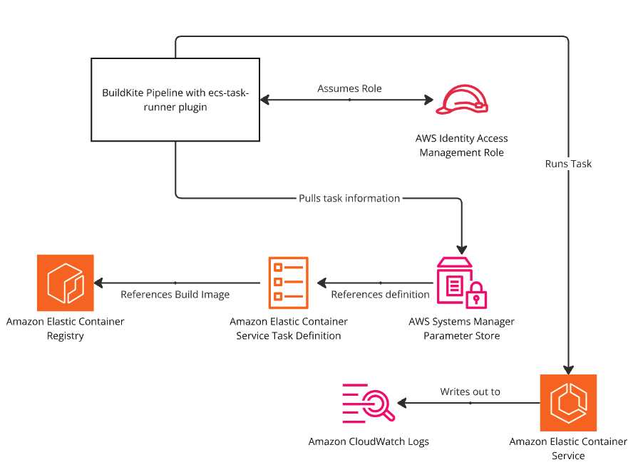

# ECS Task Runner

## Example

Add the following lines to your `pipeline.yml`:

```yml
steps:
  - plugins:
      - cultureamp/ecs-task-runner#v0.0.0:
          message: "This is the message that will be annotated!"
```

## Configuration

### `message` (Required, string)

The message to annotate onto the build.

## Usage
This plugin is based on an existing pattern in `murmur` where database migrations are run as a task on ECS. To provide additional context for how this plugin is expected to be used, this is the expected pattern:

- A CI image is built and pushed to ECR
- The entrypoint of the image is overridden in the task definition to run the specific migration task

# Requisite Infrastructure

This plugin comes with some assumed infrastructure that needs to be deployed before it can be run. This infrastructure is as follows:

- An ECS cluster
- An ECS task definition
- An ECR image
- An IAM role for the ECS task
- An IAM role for the BK agent to start the task
- A Parameter Store parameter defining the task configuration (including security groups, etc)
- A log group for the task
- A security group for your service (this can be the [base-infrastructure-for-services](https://github.com/cultureamp/base-infrastructure-for-services) source security group

This can be visualised below:

